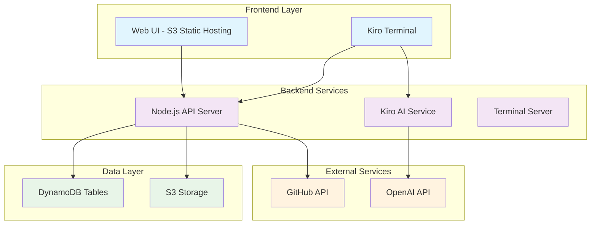
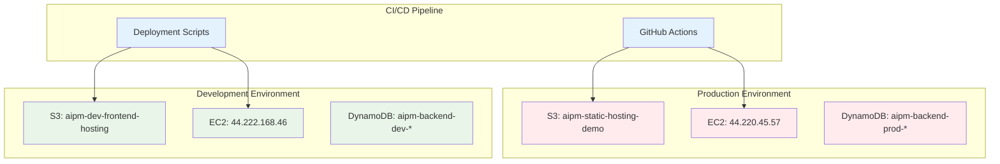
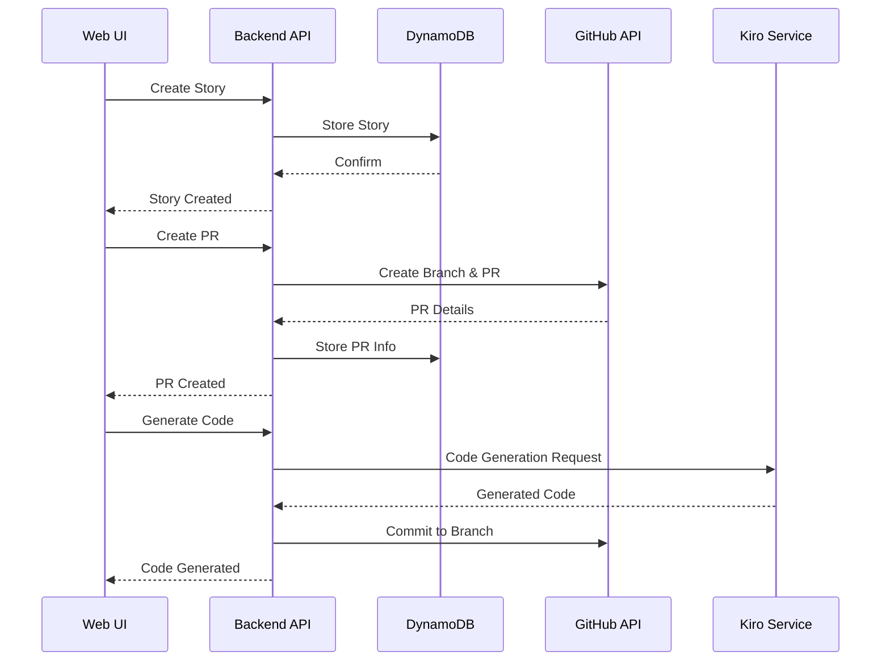

# System Architecture Overview

## 🏗️ High-Level Architecture

## 🌐 Deployment Architecture

## 🔧 Component Responsibilities

### Frontend Layer
- **Web UI**: React-like vanilla JS application for story management
- **Kiro Terminal**: Real-time terminal interface for AI interactions
- **Static Assets**: CSS, images, configuration files

### Backend Services
- **API Server**: RESTful API handling CRUD operations
- **Kiro Service**: AI-powered code generation and enhancement
- **Terminal Server**: WebSocket server for terminal functionality

### Data Layer
- **DynamoDB**: Primary data storage for stories, tests, tasks
- **S3**: Static file hosting and deployment artifacts

### External Integrations
- **GitHub API**: PR creation, branch management, repository operations
- **OpenAI API**: AI-powered story analysis and code generation

## 📊 Service Communication

## 🔐 Security Architecture

- **Authentication**: GitHub token-based authentication
- **Authorization**: Repository-level permissions
- **Data Encryption**: HTTPS/TLS for all communications
- **Access Control**: Environment-based resource isolation

## 📈 Scalability Considerations

- **Horizontal Scaling**: Multiple EC2 instances behind load balancer
- **Database Scaling**: DynamoDB auto-scaling enabled
- **CDN**: CloudFront for static asset delivery
- **Caching**: Application-level caching for frequently accessed data

---

**Last Updated**: December 29, 2025  
**Version**: 4.0.6
