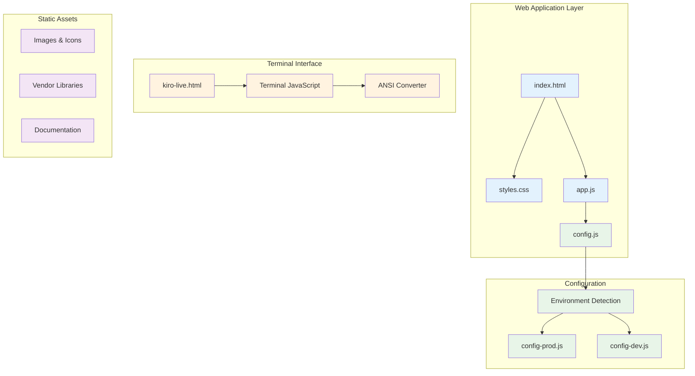
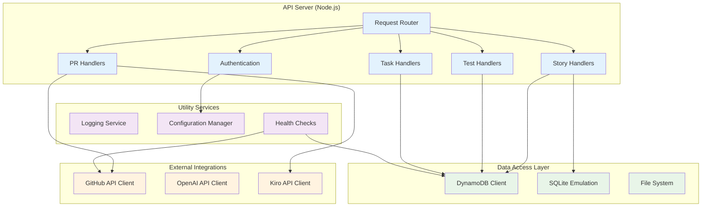
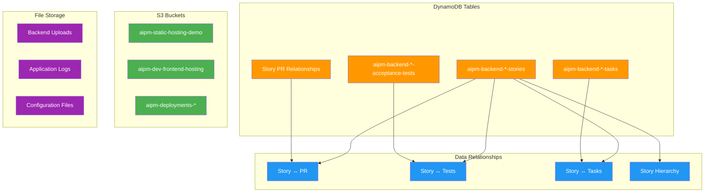
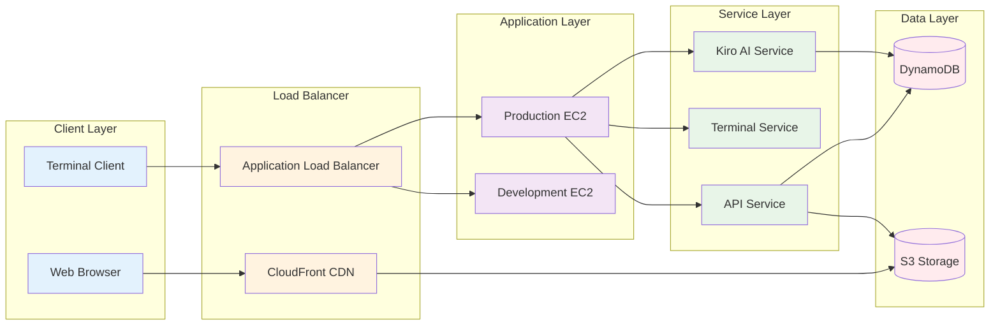
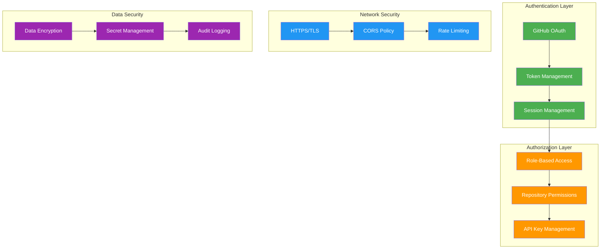
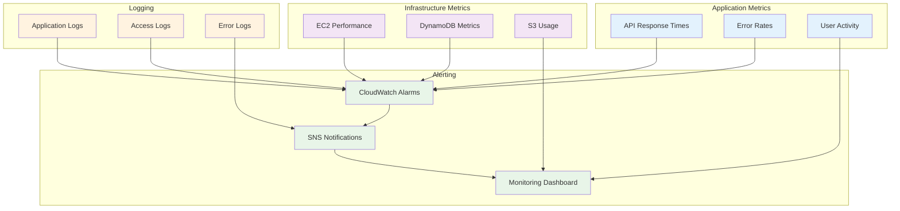

# Component Block Diagrams

## 🏗️ Frontend Architecture

## 🔧 Backend Services Architecture

## 🗄️ Data Layer Architecture

## 🔄 Service Communication Flow

## 🔐 Security Architecture

## 📊 Monitoring & Observability

---

**Last Updated**: December 29, 2025  
**Version**: 4.0.6
