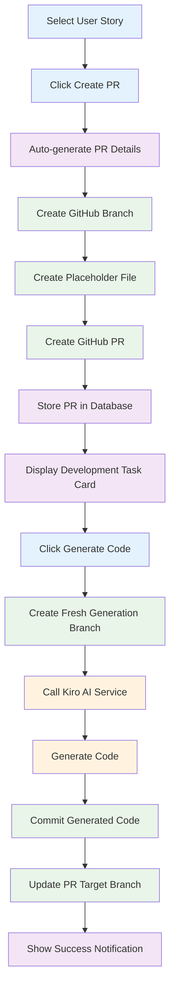
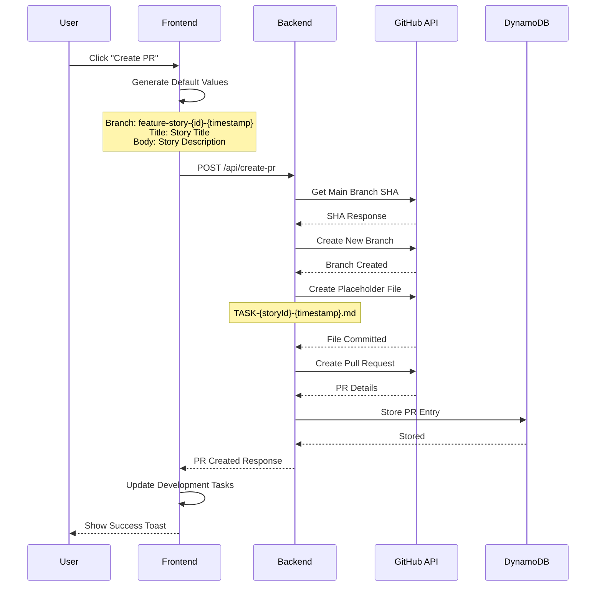
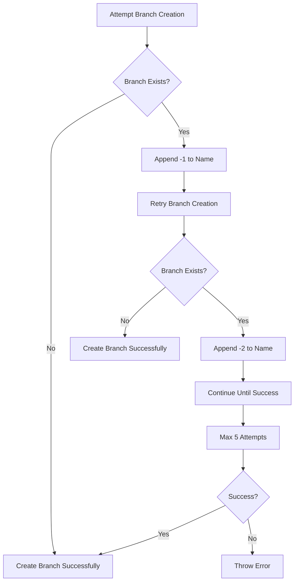
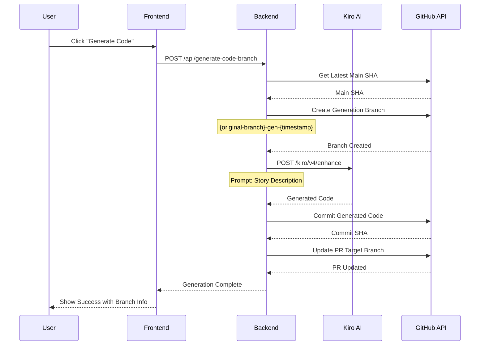
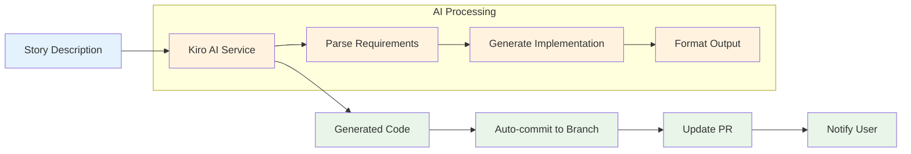
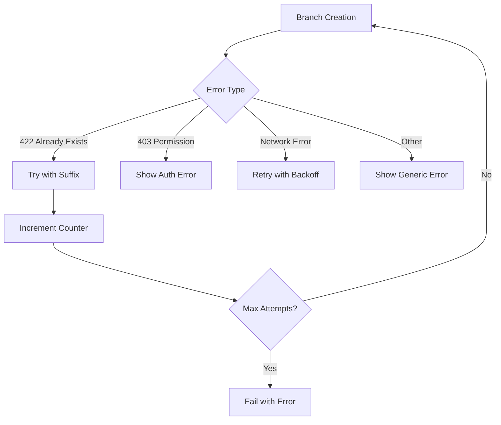

# PR Creation & Code Generation Workflow

## 🔄 Complete Workflow Overview

## 📋 PR Creation Process

### 1. User Interaction

### 2. Branch Conflict Resolution

## 🤖 Code Generation Process

### 1. Fresh Branch Strategy

### 2. Code Generation Flow

## ⚡ Optimizations Implemented

### 1. No-Modal Workflow
- **Before**: Modal → Form → Submit → Process
- **After**: Click → Process → Complete

### 2. Smart Defaults
- **Branch Name**: `feature-story-{id}-{timestamp}`
- **PR Title**: Story title
- **PR Body**: Story description with acceptance criteria
- **Code Prompt**: Story description or title

### 3. Fresh Branch Generation
- **Problem**: Conflicts and stale code
- **Solution**: Always create from latest main
- **Benefit**: Clean, conflict-free code generation

## 🔧 Error Handling

### Branch Creation Errors

### Code Generation Errors
- **Timeout**: 30-second limit with clear error message
- **AI Service Down**: Graceful fallback with retry option
- **Invalid Response**: Parse error handling with diagnostics

## 📊 Performance Metrics

- **PR Creation Time**: ~3-5 seconds
- **Code Generation Time**: ~10-30 seconds
- **Success Rate**: >95% for PR creation
- **User Satisfaction**: One-click workflow

---

**Last Updated**: December 29, 2025  
**Version**: 4.0.6
